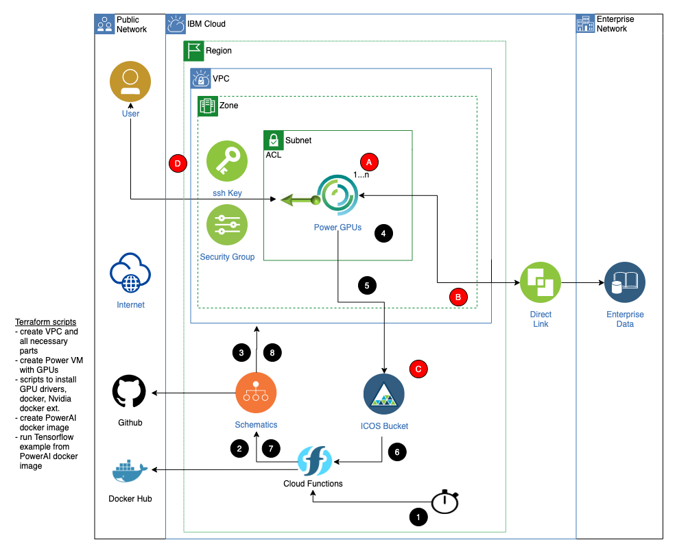

# AI workloads in the IBM Cloud
This project provides the files and information for using various IBM Cloud services to automate the creation
of a VPC and a Power GPU virtual machine. A PowerAI sample tensorflow python script is then run and the output
is written to an IBM Cloud Object Storage bucket. This is all driven by an IBM Cloud function triggered by a
timer. A second trigger will be invoked when the ICOS bucket is written to and will destroy the environment. 

**Note:** 
1. In the instructions below you will be creating IBM Cloud resources. When creating resources where you can specify a region, insure you always choose the same region (i.e. us-south or Dallas).
2. You will need an IBM Cloud API key. Insure the user associated with the key has the necessary permissions to create and use the IBM Cloud services.

The following picture illustrates the solution:

1. A alarm trigger in IBM Cloud Functions occurs
2. An IBM Cloud function is invoked from the trigger
3. The action, via the IBM CLI, calls the apply plan action on an IBM Schematics workspace. Terraform creates the VPC (and supporting resources) including a Power-GPU virtual machine
4. Once the VPC and VM are created, the last step of the terraform script is to run a series of scripts to install
the necessary drivers and software including PowerAI and finally executing an example Tensorflow python script.
5. The python script output is written to an IBM Cloud Object Storage bucket
6. An trigger is fired when the object storage bucket is written to
7. An IBM Cloud function is invoked from the trigger
8. The action, via the IBM CLI, calls the destroy plan action on the IBM Schematics workspace. Terraform destroys all the resources

## IBM Cloud Object Storage
In order to create the IBM Cloud Object storage resources, follow these steps:
1. Create an IBM Cloud Object Storage instance from the IBM Cloud catalog. Note the name
2. Within the IBM Cloud Oject Storage instance, create a Regional bucket (insure you pick the correct region)

## IBM Schematics
The terraform in this Github project provide all the necessary details to create the VPC environment and run the workload. Follow these steps to create a Schematics workspace
1. Create an IBM Schematics workspace from the IBM Cloud catalog.
2. Provide your version of this Github project as its source. It will scan the terraform files and find the variables
3. Override any of the variable to fit your specifics. Note that the VPC region and and zone are specified. 
4. There are 3 variables that you need to provide at the bottom of the list, icos_endpoint, icos_key, and icos_secret. Get these credentials for you ICOS bucket.
5. Once the workspace is created, insure you generate the terraform plan and you have no errors.

## IBM Cloud Functions
The functions folder in this Github project provide the files necessary to create the actions, triggers, and rules. Follow the instructions in the functions-create.sh file for details. Remember, when creating your Functions namespace remember the region you have chosen.

## Make things real
In looking at the architecture diagram above again. the red letters illustrate some areas that might be addressed to make this example scenario a real one.
<ol type="A">
  <li>In a real scenario you might create more than one PowerGPU virtual machine. And you might then need additional software installed to spread your workload accross those machines. This of course is all in the details of the workflow that is specific to your needs.</li>
  <li>There might be a reason to retrieve data from on-premises data stores. In that case you will need a Direct Link service to create a private connection to your data center.</li>
  <li>Or you might want to stage and fetch data from an IBM Cloud Object storage bucket(s). This is actually a cheap and easy way to store massive amounts of data.</li>
  <li>In the example, one of the items created is a floating IP address and an ssh key that you can use to connect to the virtual machine for any deugging purposes. This might be removed in a real scenario.</li>
</ol>

## References
[Containerize PowerAI](https://developer.ibm.com/linuxonpower/tutorials/powerai-docker-images/) 
[IBM Visual Insights](https://github.com/IBM/vision-terraform)
